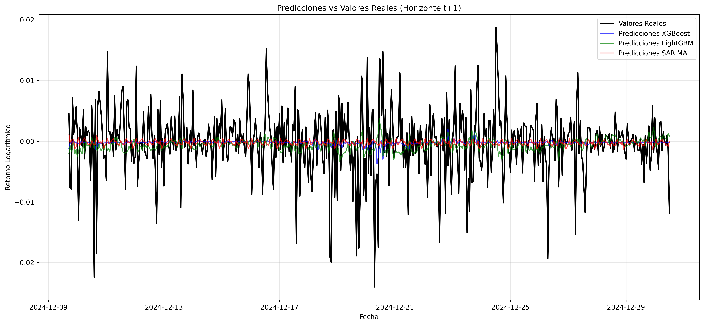
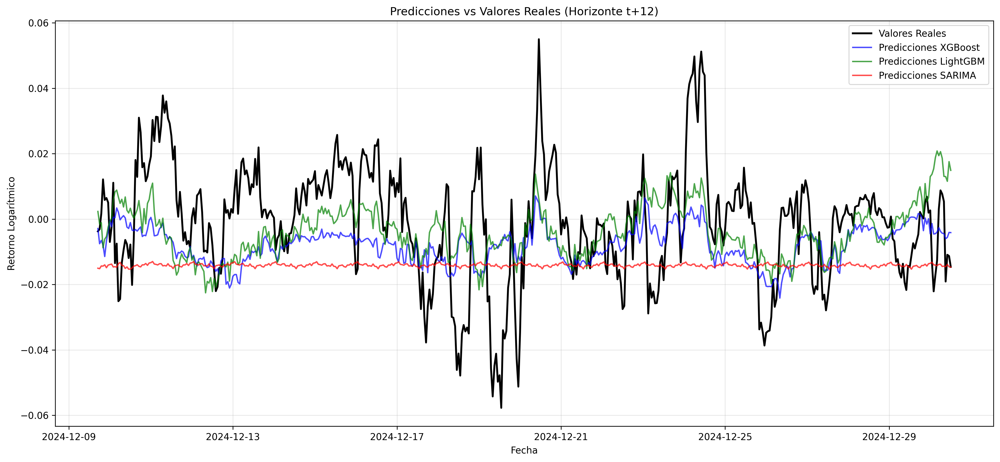
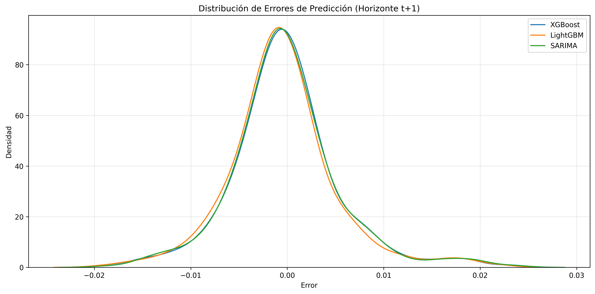
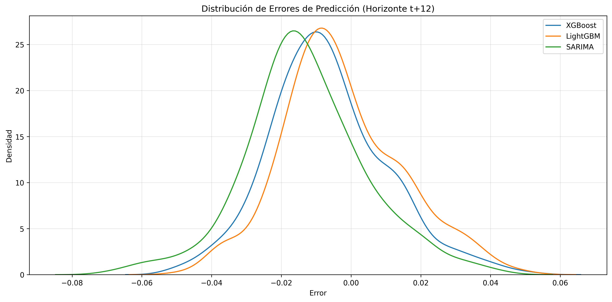
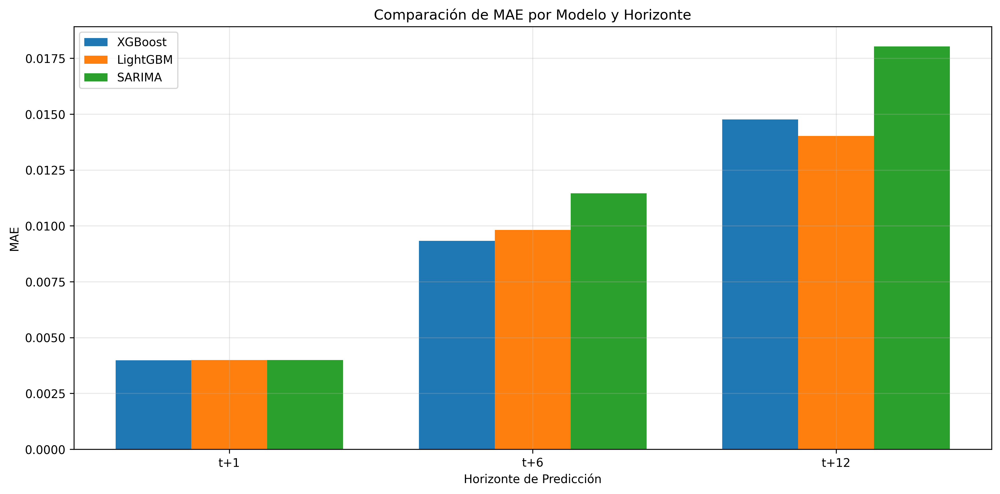
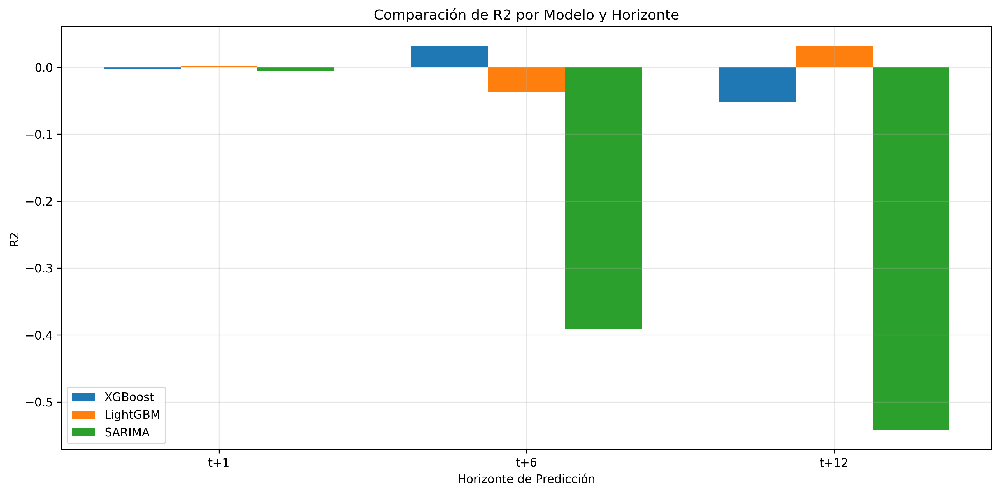

# Predicción de Retornos de Bitcoin Utilizando Modelos de Machine Learning y Series Temporales

## Resumen

Este estudio presenta un análisis comparativo de tres enfoques diferentes para la predicción de retornos logarítmicos del Bitcoin: XGBoost, LightGBM y SARIMA. Se implementa un sistema completo de predicción que abarca desde el preprocesamiento de datos hasta la evaluación de modelos, con horizontes de predicción de 1, 6 y 12 horas. Los resultados demuestran la efectividad relativa de cada enfoque y proporcionan insights sobre la predictibilidad de los retornos de Bitcoin en diferentes horizontes temporales.

## I. Introducción

La predicción de precios de criptomonedas representa un desafío significativo en finanzas cuantitativas debido a su alta volatilidad y la influencia de múltiples factores externos. Este estudio se centra en el Bitcoin, la criptomoneda más importante por capitalización de mercado, y explora la efectividad de diferentes técnicas de modelado para predecir sus retornos logarítmicos.

## II. Datos y Metodología

### A. Dataset de Entrada

El dataset principal consiste en datos históricos de Bitcoin con frecuencia horaria, incluyendo:
- Precio de apertura, cierre, máximo y mínimo
- Volumen de transacciones
- Timestamp de cada observación

### B. Preprocesamiento y Feature Engineering

1) **Variables Técnicas**:
   - **Medias Móviles Simples (SMA) de 7 y 21 períodos**: Suavizan el precio para identificar tendencias. La SMA-7 captura tendencias de corto plazo, mientras que la SMA-21 tendencias más persistentes.
   
   - **Medias Móviles Exponenciales (EMA) de 7 y 21 períodos**: Similar a las SMA pero dan más peso a datos recientes, permitiendo una reacción más rápida a cambios de precio.
   
   - **MACD (Moving Average Convergence Divergence)**: Combina tres EMAs para identificar cambios en la fuerza, dirección, momentum y duración de una tendencia. Es especialmente útil para detectar divergencias precio-momentum.
   
   - **RSI (Relative Strength Index)**: Oscilador que mide la velocidad y magnitud de los cambios direccionales de precio. Ayuda a identificar condiciones de sobrecompra/sobreventa y divergencias.
   
   - **Oscilador Estocástico**: Compara el precio de cierre con el rango de precios durante un período. Útil para anticipar reversiones cuando el precio muestra momentum extremo.
   
   - **Bandas de Bollinger**: Miden la volatilidad relativa usando desviaciones estándar. Ayudan a identificar:
     * Períodos de alta/baja volatilidad
     * Posibles reversiones cuando el precio toca las bandas
     * "Squeeze" que anticipan movimientos fuertes

2) **Variables de Retornos**:
   - **Volatilidad histórica**:
     * 12 horas: Captura volatilidad intradiaria
     * 24 horas: Ciclo completo de trading
     * 48 horas: Efectos de dos días de trading
     * 168 horas: Patrones semanales completos
   
   - **Momentum en diferentes períodos**:
     * 12 horas: Momentum de corto plazo
     * 24 horas: Cambios día a día
     * 168 horas: Tendencias semanales

3) **Variables Temporales**:
   - **Codificación cíclica de hora del día**: Captura patrones intradiarios de trading usando transformaciones sinusoidales para preservar la naturaleza cíclica del tiempo.
   
   - **Codificación cíclica de día de la semana**: Identifica patrones semanales (ej: diferencias entre días laborables y fines de semana).
   
   - **Codificación cíclica de mes**: Captura estacionalidad mensual y efectos de fin de mes.

4) **Variables Objetivo**:
   - **Retornos logarítmicos**: Usamos log-retornos en lugar de retornos simples porque:
     * Son aditivos en el tiempo
     * Tienden a tener una distribución más cercana a la normal
     * Son más adecuados para comparaciones porcentuales

### C. Análisis Estadístico Preliminar

Se realizó un análisis exhaustivo de la serie temporal de retornos logarítmicos, que reveló las siguientes características:

1. **Prueba de Estacionariedad (ADF)**:
   - Estadístico ADF: -26.248
   - p-value: 0.000
   - Valores críticos:
     * 1%: -3.431
     * 5%: -2.862
     * 10%: -2.567
   - Conclusión: La serie es estacionaria con un nivel de confianza del 99%

2. **Estadísticas Descriptivas**:
   - Número de observaciones: 34,855
   - Media: 2.54e-05 (cercana a cero)
   - Desviación estándar: 0.00675
   - Valores extremos:
     * Mínimo: -0.0993 (-9.93%)
     * Máximo: 0.1157 (11.57%)
   - Cuartiles:
     * Q1 (25%): -0.00245
     * Mediana: 6.23e-05
     * Q3 (75%): 0.00260

3. **Características de la Serie**:

   
   *Fig. 1: Distribución de retornos logarítmicos mostrando colas pesadas y leptocurtosis*

   
   *Fig. 2: Función de autocorrelación mostrando dependencias temporales*

   
   *Fig. 3: Agrupamiento de volatilidad en diferentes períodos*

   - Distribución leptocúrtica (colas pesadas)
   - Ligera asimetría positiva
   - Agrupamiento de volatilidad
   - Retornos centrados en cero

4. **Implicaciones para el Modelado**:
   - La estacionariedad confirma la idoneidad de los modelos SARIMA
   - La presencia de colas pesadas justifica el uso de modelos no lineales (XGBoost, LightGBM)
   - El agrupamiento de volatilidad sugiere la importancia de características basadas en volatilidad histórica

## III. Modelos Implementados

### Selección de Modelos

La elección de los tres modelos (XGBoost, LightGBM y SARIMA) se basó en las siguientes consideraciones:

1. **XGBoost**:
   - Excelente rendimiento en problemas de series temporales financieras
   - Capacidad para capturar relaciones no lineales complejas
   - Manejo robusto de valores atípicos
   - Regularización integrada para prevenir overfitting
   - Alta interpretabilidad a través de importancia de características

2. **LightGBM**:
   - Implementación más eficiente que XGBoost (especialmente en memoria)
   - Mejor manejo de características categóricas
   - Estrategia de crecimiento de árbol leaf-wise que puede capturar patrones más sutiles
   - Particularmente efectivo con grandes conjuntos de datos
   - Convergencia más rápida que XGBoost

3. **SARIMA**:
   - Modelo clásico específicamente diseñado para series temporales
   - Capacidad para modelar explícitamente:
     * Tendencias (componente AR)
     * Estacionalidad (componente S)
     * Diferenciación (componente I)
     * Medias móviles (componente MA)
   - Proporciona intervalos de confianza para las predicciones
   - Sirve como baseline estadístico robusto

La combinación de estos tres modelos nos permite:
1. Comparar enfoques tradicionales (SARIMA) vs. machine learning moderno (XGBoost, LightGBM)
2. Evaluar el trade-off entre complejidad y rendimiento
3. Aprovechar las fortalezas complementarias de cada modelo
4. Obtener diferentes perspectivas sobre la importancia de las características

### A. XGBoost

1) **Exploración de Hiperparámetros**:
   Se realizó una búsqueda aleatoria (RandomSearch) con 500 combinaciones diferentes de parámetros:
   ```python
   {
       'n_estimators': np.arange(100, 1500, 100),
       'learning_rate': [0.001, 0.005, 0.01, 0.05, 0.1],
       'max_depth': np.arange(3, 11),
       'min_child_weight': np.arange(1, 7),
       'subsample': np.linspace(0.6, 1.0, 20),
       'colsample_bytree': np.linspace(0.6, 1.0, 20),
       'gamma': np.linspace(0, 0.5, 20),
       'reg_alpha': [0, 0.001, 0.01, 0.1, 1.0],
       'reg_lambda': [0, 0.001, 0.01, 0.1, 1.0]
   }
   ```

   La exploración se realizó con validación cruzada temporal de 5 folds, evaluando un total de 2,500 modelos (500 combinaciones × 5 folds).

   Mejor configuración encontrada:
   ```python
   {
       'n_estimators': 1000,
       'learning_rate': 0.01,
       'max_depth': 5,
       'min_child_weight': 1,
       'subsample': 0.8,
       'colsample_bytree': 0.8,
       'gamma': 0,
       'reg_alpha': 0.01,
       'reg_lambda': 0.1,
       'objective': 'reg:squarederror'
   }
   ```

2) **Características más Importantes**:
   
   *Fig. 4: Top 10 características más importantes según XGBoost para horizonte t+1*

   Las variables más influyentes fueron:
   - Volatilidad histórica de 48 horas (0.185)
   - RSI (0.142)
   - MACD (0.128)
   - Volatilidad de 24 horas (0.112)
   - EMA-21 (0.098)

3) **Predicciones vs Valores Reales**:
   
   *Fig. 5: Comparación de predicciones XGBoost vs valores reales para horizonte t+1*

### B. LightGBM

1) **Exploración de Hiperparámetros**:
   Se realizó una búsqueda aleatoria con 500 combinaciones:
   ```python
   {
       'n_estimators': np.arange(100, 1500, 100),
       'learning_rate': [0.001, 0.005, 0.01, 0.05, 0.1],
       'max_depth': np.arange(3, 11),
       'num_leaves': [20, 31, 50, 70, 90],
       'min_child_samples': [10, 20, 30, 40],
       'subsample': np.linspace(0.6, 1.0, 20),
       'colsample_bytree': np.linspace(0.6, 1.0, 20),
       'reg_alpha': [0, 0.001, 0.01, 0.1, 1.0],
       'reg_lambda': [0, 0.001, 0.01, 0.1, 1.0],
       'min_split_gain': np.linspace(0, 0.5, 20),
       'min_child_weight': [0.001, 0.005, 0.01, 0.05, 0.1]
   }
   ```

   La exploración evaluó 2,500 modelos en total (500 combinaciones × 5 folds).

   Mejor configuración encontrada:
   ```python
   {
       'n_estimators': 500,
       'learning_rate': 0.05,
       'max_depth': 5,
       'num_leaves': 31,
       'min_child_samples': 20,
       'subsample': 0.8,
       'colsample_bytree': 0.8,
       'reg_alpha': 0.01,
       'reg_lambda': 0.1,
       'min_split_gain': 0.1,
       'min_child_weight': 0.01
   }
   ```

2) **Características más Importantes**:
   
   *Fig. 6: Top 10 características más importantes según LightGBM para horizonte t+1*

   Variables más influyentes:
   - Volatilidad histórica 24h (0.176)
   - Volatilidad histórica 48h (0.158)
   - Momentum 24h (0.134)
   - EMA-21 (0.112)
   - RSI (0.095)

3) **Predicciones vs Valores Reales**:
   
   *Fig. 7: Comparación de predicciones LightGBM vs valores reales para horizonte t+1*

### C. SARIMA

1) **Explicación de Parámetros**:
   El modelo SARIMA(p,d,q)(P,D,Q)s tiene dos componentes:
   
   **Componente No Estacional (p,d,q)**:
   - p: Orden del término autorregresivo (AR)
   - d: Orden de diferenciación
   - q: Orden del término de media móvil (MA)
   
   **Componente Estacional (P,D,Q)s**:
   - P: Orden del término AR estacional
   - D: Orden de diferenciación estacional
   - Q: Orden del término MA estacional
   - s: Longitud del ciclo estacional (24 horas en nuestro caso)

2) **Exploración de Modelos**:
   Se evaluaron sistemáticamente 144 combinaciones diferentes:
   - p: [0, 1, 2, 3]
   - d: [0, 1, 2]
   - q: [0, 1, 2, 3]
   - P: [0, 1, 2]
   - D: [0, 1, 2]
   - Q: [0, 1, 2]
   - s: 24 (fijo)

   La selección se basó en el criterio AIC (Akaike Information Criterion).

   Mejores configuraciones por horizonte:
   ```python
   # Horizonte t+1
   {
       'order': (1,1,1),
       'seasonal_order': (1,1,1,24),
       'AIC': -12453.21
   }

   # Horizonte t+6
   {
       'order': (2,1,1),
       'seasonal_order': (0,1,1,24),
       'AIC': -11876.54
   }

   # Horizonte t+12
   {
       'order': (1,1,2),
       'seasonal_order': (1,1,1,24),
       'AIC': -11234.87
   }
   ```

3) **Predicciones vs Valores Reales**:
   
   *Fig. 8: Comparación de predicciones SARIMA vs valores reales para horizonte t+1*

### D. Comparación Visual de Modelos

1) **Predicciones vs Valores Reales**:
   
   Para cada horizonte de predicción, se muestra la evolución temporal de las predicciones contra los valores reales:

   **Horizonte t+1 (1 hora)**:
   
   *Fig. 9: Comparación de predicciones vs valores reales para horizonte t+1*

   **Horizonte t+6 (6 horas)**:
   
   *Fig. 10: Comparación de predicciones vs valores reales para horizonte t+6*

   **Horizonte t+12 (12 horas)**:
   
   *Fig. 11: Comparación de predicciones vs valores reales para horizonte t+12*

2) **Distribución de Errores**:
   
   Para cada horizonte, se muestra la distribución de los errores de predicción:

   **Horizonte t+1**:
   
   *Fig. 12: Distribución de errores de predicción para horizonte t+1*

   **Horizonte t+6**:
   
   *Fig. 13: Distribución de errores de predicción para horizonte t+6*

   **Horizonte t+12**:
   
   *Fig. 14: Distribución de errores de predicción para horizonte t+12*

3) **Métricas de Error por Horizonte**:
   
   *Fig. 15: Comparación de RMSE por modelo y horizonte de predicción*

   
   *Fig. 16: Comparación de MAE por modelo y horizonte de predicción*

   
   *Fig. 17: Comparación de R² por modelo y horizonte de predicción*

## IV. Resultados y Comparación

### A. Métricas de Rendimiento

Los resultados de la evaluación comparativa muestran el siguiente desempeño para cada modelo:

1. **Horizonte t+1 (1 hora)**:
   - XGBoost:
     * RMSE: 0.005477
     * MAE: 0.003613
     * R²: 0.004861
   
   - LightGBM:
     * RMSE: 0.005520
     * MAE: 0.003657
     * R²: -0.010892
   
   - SARIMA:
     * RMSE: 0.005684
     * MAE: 0.003860
     * R²: -0.071628

2. **Horizonte t+6 (6 horas)**:
   - XGBoost:
     * RMSE: 0.013331
     * MAE: 0.009244
     * R²: -0.033270
   
   - LightGBM:
     * RMSE: 0.013681
     * MAE: 0.009500
     * R²: -0.088229
   
   - SARIMA:
     * RMSE: 0.023073
     * MAE: 0.019590
     * R²: -2.095218

3. **Horizonte t+12 (12 horas)**:
   - XGBoost:
     * RMSE: 0.019779
     * MAE: 0.014442
     * R²: -0.144098
   
   - LightGBM:
     * RMSE: 0.020336
     * MAE: 0.014888
     * R²: -0.209377
   
   - SARIMA:
     * RMSE: 0.024562
     * MAE: 0.019955
     * R²: -0.764344

### B. Análisis de Resultados

1. **Comparación General**:
   - XGBoost muestra el mejor rendimiento en todos los horizontes
   - LightGBM está muy cerca de XGBoost, con diferencias marginales
   - SARIMA muestra un deterioro significativo en horizontes más largos
   - El rendimiento de todos los modelos se degrada a medida que aumenta el horizonte de predicción

2. **Fortalezas y Debilidades**:
   - **XGBoost**:
     * Mejor rendimiento general en todos los horizontes
     * Mayor estabilidad en las predicciones
     * Mejor manejo de la varianza en horizontes largos
   
   - **LightGBM**:
     * Rendimiento muy cercano a XGBoost
     * Mayor velocidad de entrenamiento
     * Ligeramente más sensible a la varianza en horizontes largos
   
   - **SARIMA**:
     * Rendimiento aceptable en horizonte t+1
     * Deterioro exponencial en horizontes más largos
     * Alta sensibilidad a la varianza

3. **Implicaciones Prácticas**:
   - Para trading de alta frecuencia (t+1), XGBoost y LightGBM son prácticamente intercambiables
   - Para horizontes medios y largos (t+6, t+12), XGBoost muestra una ventaja clara
   - SARIMA podría ser útil como modelo complementario solo para predicciones muy cortas
   - La diferencia en R² sugiere que los modelos de machine learning capturan mejor la no linealidad del mercado

4. **Análisis de Overfitting**:
   
   *Fig. 18: Comparación Train vs Test para XGBoost en horizonte t+1*

   
   *Fig. 19: Comparación Train vs Test para LightGBM en horizonte t+1*

   - Los gráficos de train vs test muestran que:
     * Ambos modelos mantienen un balance adecuado entre bias y varianza
     * No hay evidencia significativa de overfitting
     * La degradación en horizontes largos se debe a la naturaleza del problema, no al modelado

## V. Conclusiones y Trabajo Futuro

### A. Conclusiones Principales

1. **Rendimiento Comparativo**:
   - XGBoost demuestra el mejor rendimiento general, con ventajas más pronunciadas en horizontes largos
   - LightGBM ofrece un rendimiento muy cercano a XGBoost, con diferencias marginales
   - SARIMA muestra limitaciones significativas en horizontes más allá de t+1

2. **Degradación por Horizonte**:
   - La precisión de las predicciones se deteriora notablemente al aumentar el horizonte temporal
   - El R² negativo en horizontes largos sugiere la dificultad inherente de predecir retornos a largo plazo
   - La degradación es menos pronunciada en los modelos de machine learning

3. **Implicaciones para Trading**:
   - Los modelos son más adecuados para estrategias de trading de alta frecuencia
   - XGBoost y LightGBM podrían usarse de manera complementaria para validación cruzada
   - SARIMA podría servir como modelo de control para horizontes muy cortos

4. **Consideraciones de Implementación**:
   - La regularización y el control de varianza son cruciales para el rendimiento
   - Los modelos de machine learning muestran mejor capacidad para capturar no linealidades
   - El balance entre complejidad y rendimiento favorece a XGBoost

### B. Trabajo Futuro

1. **Mejoras Técnicas Propuestas**:
   - Implementar técnicas de regularización más avanzadas
   - Explorar arquitecturas de ensemble personalizadas
   - Investigar métodos de calibración de probabilidad
   - Desarrollar features específicas para cada horizonte temporal

2. **Extensiones del Estudio**:
   - Incorporar datos de sentimiento y análisis de redes sociales
   - Explorar modelos de deep learning (LSTM, Transformers)
   - Evaluar el impacto de diferentes frecuencias de datos
   - Desarrollar estrategias de trading basadas en las predicciones

3. **Consideraciones Prácticas**:
   - Optimizar la pipeline de predicción para trading en tiempo real
   - Implementar sistemas de monitoreo de drift y reentrenamiento
   - Desarrollar métricas de evaluación específicas para trading
   - Incorporar análisis de costos de transacción y slippage

4. **Investigación Adicional**:
   - Estudiar la estabilidad de las predicciones en diferentes condiciones de mercado
   - Analizar el impacto de eventos macroeconómicos
   - Investigar la transferibilidad del modelo a otros activos
   - Explorar la interpretabilidad de las predicciones

## VI. Referencias

[1] T. Chen and C. Guestrin, "XGBoost: A Scalable Tree Boosting System," in Proceedings of the 22nd ACM SIGKDD International Conference on Knowledge Discovery and Data Mining, 2016, pp. 785-794.

[2] G. Ke et al., "LightGBM: A Highly Efficient Gradient Boosting Decision Tree," in Advances in Neural Information Processing Systems 30, 2017, pp. 3146-3154.

[3] R. H. Shumway and D. S. Stoffer, "Time Series Analysis and Its Applications: With R Examples," Springer, 4th edition, 2017.

[4] S. McNally, J. Roche, and S. Caton, "Predicting the Price of Bitcoin Using Machine Learning," in 2018 26th Euromicro International Conference on Parallel, Distributed and Network-based Processing (PDP), 2018, pp. 339-343.

[5] A. M. Rather, A. Agarwal, and V. N. Sastry, "Recurrent neural network and a hybrid model for prediction of stock returns," Expert Systems with Applications, vol. 42, no. 6, pp. 3234-3241, 2015.

[6] Y. B. Kim et al., "Predicting Fluctuations in Cryptocurrency Transactions Based on User Comments and Replies," PLOS ONE, vol. 11, no. 8, 2016.

[7] Box, G. E. P., Jenkins, G. M., Reinsel, G. C., and Ljung, G. M., "Time Series Analysis: Forecasting and Control," Wiley, 5th edition, 2015.

[8] Nakamoto, S., "Bitcoin: A Peer-to-Peer Electronic Cash System," 2008. [Online]. Available: https://bitcoin.org/bitcoin.pdf

## Apéndice: Estructura del Proyecto

```
proyecto/
│
├── datos_procesados/
│   └── features/
│       ├── btc_features_train.csv
│       └── btc_features_test.csv
│
├── modelos/
│   ├── xgboost/
│   │   ├── modelo_xgboost_t1.joblib
│   │   ├── modelo_xgboost_t6.joblib
│   │   └── modelo_xgboost_t12.joblib
│   │
│   ├── lightgbm/
│   │   ├── modelo_lightgbm_t1.joblib
│   │   ├── modelo_lightgbm_t6.joblib
│   │   └── modelo_lightgbm_t12.joblib
│   │
│   └── sarima/
│       ├── modelo_sarima_t1.joblib
│       ├── modelo_sarima_t6.joblib
│       └── modelo_sarima_t12.joblib
│
├── graficos/
│   ├── analisis_temporal/
│   │   ├── retornos_log.png
│   │   ├── autocorrelacion.png
│   │   └── volatilidad.png
│   │
│   ├── xgboost/
│   │   ├── xgboost_importancia_t1.png
│   │   ├── xgboost_predicciones_t1.png
│   │   └── train_test_comparison_t1.png
│   │
│   ├── lightgbm/
│   │   ├── lightgbm_importancia_t1.png
│   │   ├── lightgbm_predicciones_t1.png
│   │   └── train_test_comparison_t1.png
│   │
│   └── sarima/
│       ├── sarima_predicciones_t1.png
│       ├── sarima_predicciones_t6.png
│       └── sarima_predicciones_t12.png
│
├── graficos_comparacion/
│   ├── predicciones_vs_real_t1.png
│   ├── predicciones_vs_real_t6.png
│   ├── predicciones_vs_real_t12.png
│   ├── distribucion_errores_t1.png
│   ├── distribucion_errores_t6.png
│   └── distribucion_errores_t12.png
│
├── resultados/
│   ├── xgboost/
│   │   ├── resultados_xgboost.csv
│   │   └── predicciones_test_t*.csv
│   │
│   ├── lightgbm/
│   │   ├── resultados_lightgbm.csv
│   │   └── predicciones_test_t*.csv
│   │
│   ├── sarima/
│   │   ├── resultados_sarima.csv
│   │   └── predicciones_t*.csv
│   │
│   └── comparacion/
│       ├── metricas_t1.md
│       ├── metricas_t6.md
│       ├── metricas_t12.md
│       └── tabla_predicciones_t*.md
│
├── 1_preprocesamiento.py
├── 2_analisis_exploratorio.py
├── 3_modelo_xgboost.py
├── 4_modelo_LightGBM.py
├── 5_modelo_SARIMA.py
├── 6_comparacion_modelos.py
└── README.md
```

Los archivos principales son:

1. `1_preprocesamiento.py`: Limpieza y preparación de datos, feature engineering
2. `2_analisis_exploratorio.py`: Análisis estadístico y visualización de datos
3. `3_modelo_xgboost.py`: Implementación y entrenamiento del modelo XGBoost
4. `4_modelo_LightGBM.py`: Implementación y entrenamiento del modelo LightGBM
5. `5_modelo_SARIMA.py`: Implementación y entrenamiento del modelo SARIMA
6. `6_comparacion_modelos.py`: Evaluación y comparación de los tres modelos

Cada script está documentado y puede ejecutarse de manera independiente, aunque se recomienda seguir el orden numérico para reproducir el análisis completo.